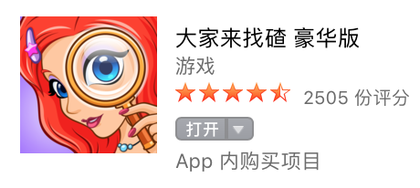
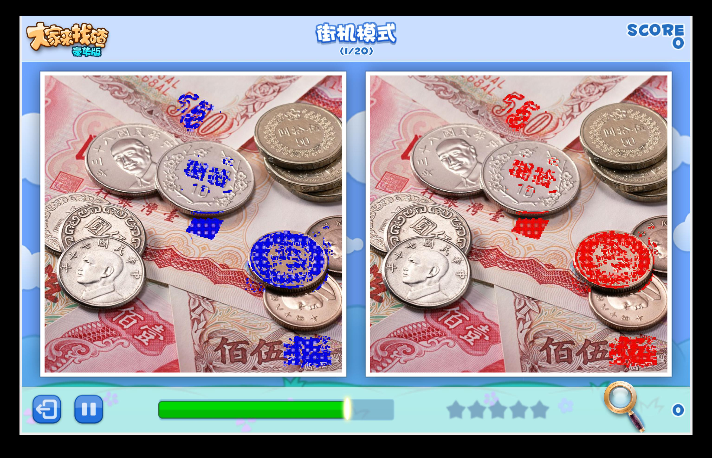

# Img Diff

用于辅助寻找 游戏大家来找碴 中两幅图片的不同 

## 开发环境
    
    python 2.7.12
    
    Django==1.10.3
    image==1.5.5
    Pillow==3.4.2
    pyobjc-core==3.1.1
    pyobjc-framework-Cocoa==3.1.1
    pyobjc-framework-Quartz==3.1.1
    wheel==0.24.0

## 如何运行

	设置好 config.ini 中的具体参数后
	python img_diff.py

## config.ini 中 section 的情况

    IMG_DIFF 中设置图片的相关信息，扫描的起始点，图片大小，左右图片距离，像素相似度以及区域相似比率等
    PATH 中设置文件位置相关信息，图片存放位置，图片名称，以及是否保存修改后的图片
    SCREEN_CAPTURE 中设置程序运行等待时间，即在几秒后截图并分析
    
## 程序运行过程

